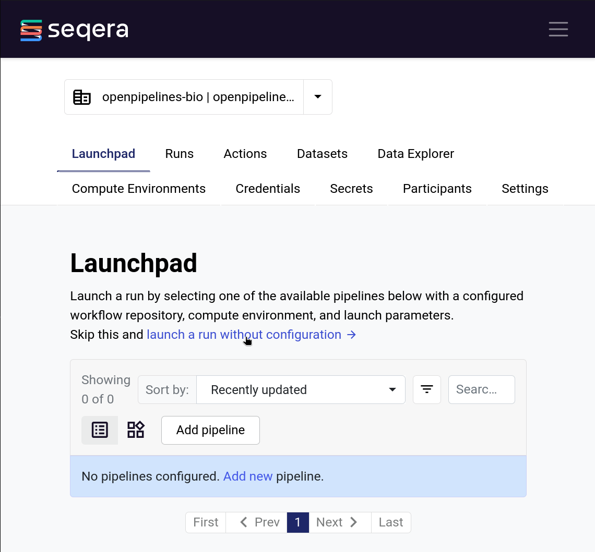

Depending on whether you want to run a workflow locally or on cloud infrastructure, using Seqera Platform (Nextflow Tower) or not, you will need to use different commands.

## Run locally from the CLI

You can run a workflow from the command line using the following command:

```bash
nextflow run openpipelines-bio/openpipeline \
  -main-script target/nextflow/workflows/integration/harmony_leiden/main.nf \
  -revision 4.0.3 \
  -latest \
  -profile docker \
  --publish_dir results/ \
  --id my_sample \
  --input input.h5mu \
  --output output.h5mu
```

Doing so will run the workflow **locally** using a Docker container.

## On cloud infrastructure

You can use a similar command to run the workflow on cloud infrastructure, such as AWS Batch or Google Cloud Platform. However, this requires you to create a separate Nextflow config file for each cloud provider. See the [Nextflow documentation](https://www.nextflow.io/docs/latest/executor.html) for more information.

```bash
nextflow run openpipelines-bio/openpipeline \
  -main-script target/nextflow/workflows/integration/harmony_leiden/main.nf \
  -revision 4.0.3 \
  -latest \
  --publish_dir results/ \
  --id my_sample \
  --input input.h5mu \
  --output output.h5mu \
  -c configs/my_hpc.config
```

## Using the Seqera Platform CLI

If you have access to a Seqera Platform (previously Nextflow Tower) instance in which a Compute Environment has already been set up, you can run a workflow from the Seqera CLI. The command is very similar to the command to run a workflow from the CLI, but you need to:

  * Use `tw launch` instead of `nextflow run`
  * Specify the workspace ID and compute environment ID
  * Rename arguments: `-revision` to `--revision`, `-latest` to `--pull-latest`, `-main-script` to `--main-script`, `-c` to `--config`
  * Store workflow arguments in a separate yaml file (if this was not already the case).

Example:

```bash
tw launch openpipelines-bio/openpipeline \
  --revision 4.0.3 \
  --pull-latest \
  --main-script target/nextflow/workflows/integration/harmony_leiden/main.nf \
  --workspace <your workspace id> \
  --compute-env <your compute environment id> \
  --params-file params.yaml \
  --config configs/my_hpc.config
```

## Using the Seqera Platform Web UI

If you have access to a Seqera Platform (previously Nextflow Tower) instance in which a Compute Environment has already been set up, you can run a workflow from the web UI. To do so, go to the "Launchpad" and click on the button "launch a run without configuration".



Next, fill in the required fields and click on "Launch run".

* **Compute environment**: Select the compute environment you want to run the workflow on.
* **Pipeline to launch**: Fill in `openpipelines-bio/openpipeline`.
* **Revision number**: The release number of the pipeline you want to run, e.g. `4.0.3`. You can find the release number on the [GitHub releases page](https://github.com/openpipelines-bio/openpipeline/releases).
* **Work directory**: The bucket path where the scratch data is stored.
* **Pipeline parameters**: The YAML or JSON of the parameters that are passed to the pipeline. See the [Components](../components/) page for more information about the parameters of each pipeline.
